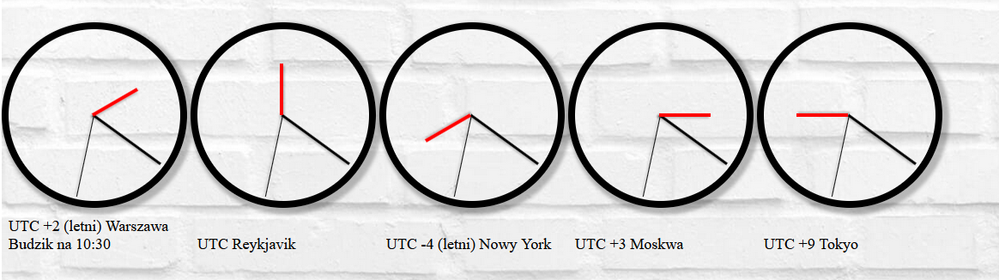

# Time-zone-clocks

> This is a set of analogue clocks, which tell current time for different time zones. It has been written in html/CSS and javascript as an assignment for my university.


## Table of Contents

* [General Info](#general-information)

* [Technologies Used](#technologies-used)

* [Features](#features)

* [Screenshot](#screenshot)

* [Setup](#setup)

* [Usage](#usage)

* [Project Status](#project-status)

* [Room for Improvement](#room-for-improvement)

* [Contact](#contact)


## General Information

  The website showcases 5 analouge clocks:
  - UTC+2
  - UTC
  - UTC-4
  - UTC+3
  - UTC+9

All of them show current time in their respective time zone


## Technologies Used

- HTML 5

- CSS

- Javascript 1.5

- Visual Studio Code 1.55.2


## Features

- Displaying current time for 5 time zones

- An alarm is set on one of the clocks

- Each time zone has a city assigned


## Screenshot




## Setup

You can open the index.html file with any web browser to view the application,
or edit all the files in an editor of your choice (for example: Visual Studio Code)


## Usage
**Setting the alarm for your time zone in the .js file**

```javascript

if (date.getHours() == 10 && date.getMinutes() == 30) { //Set hours and minutes for the alarm
        alert("Budzik 10:30!!!") //Change the alert message
```
**Changing the clock's time zone**

```javascript
    const date = new Date();
    var i = date.getHours();
    var hr = (i - 2); //Add or substract hours from your current timezone to change the clock's time zone
```

**To add an another clock:**
1. Create a new div in the body section of the .html file with the same elements inside as all the other clocks and assign an id to it
2. Add a title to your clock
3. Create a new function in the .js file by copying and pasting any of the existing functions.
4. Edit the function so the ids correspond to your id 
5. change the clock's time zone as shown above


## Project Status

The project is completed and no longer worked on as it's purpose was strictly educational.


## Room for Improvement

### Areas, which could be improved/expanded

- Option to change the timezone without editing the files

- Option to add another clock without editing the files

- Optimization of the javascript code

- Support for Automatic daylight saving time changes

- Support for automatic current timezone changes


## Contact

Created by [@AdamProsniewski](https://github.com/AdamProsniewski) - feel free to contact me!


